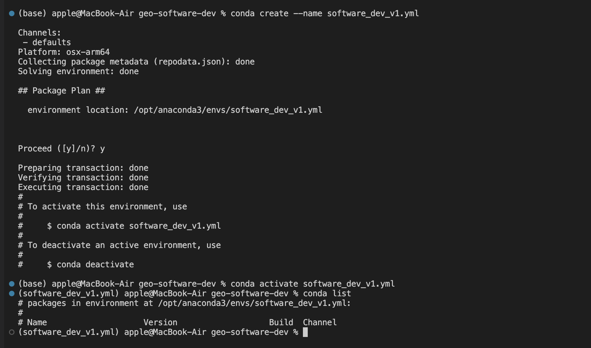
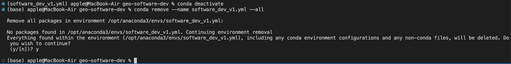
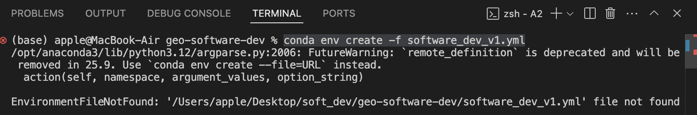
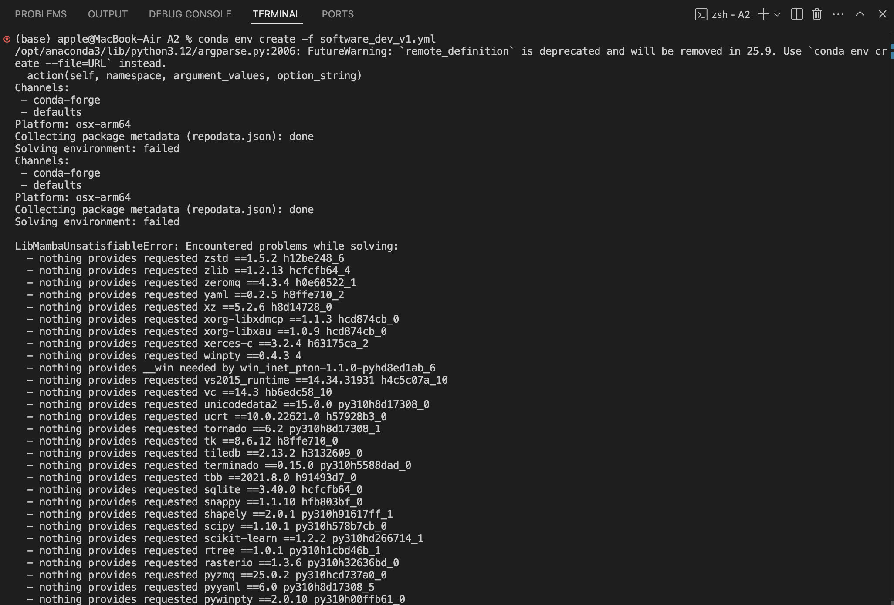
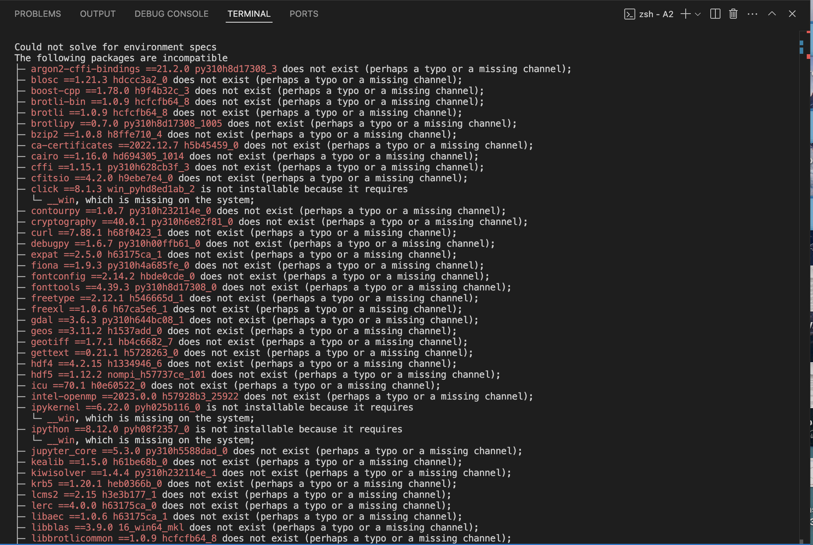
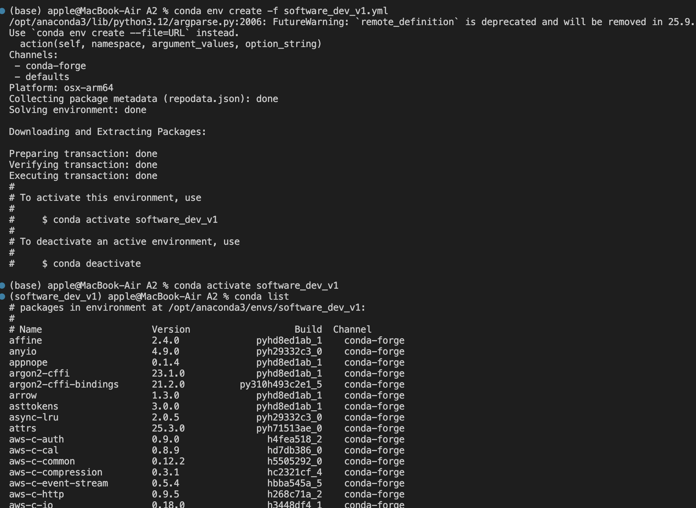
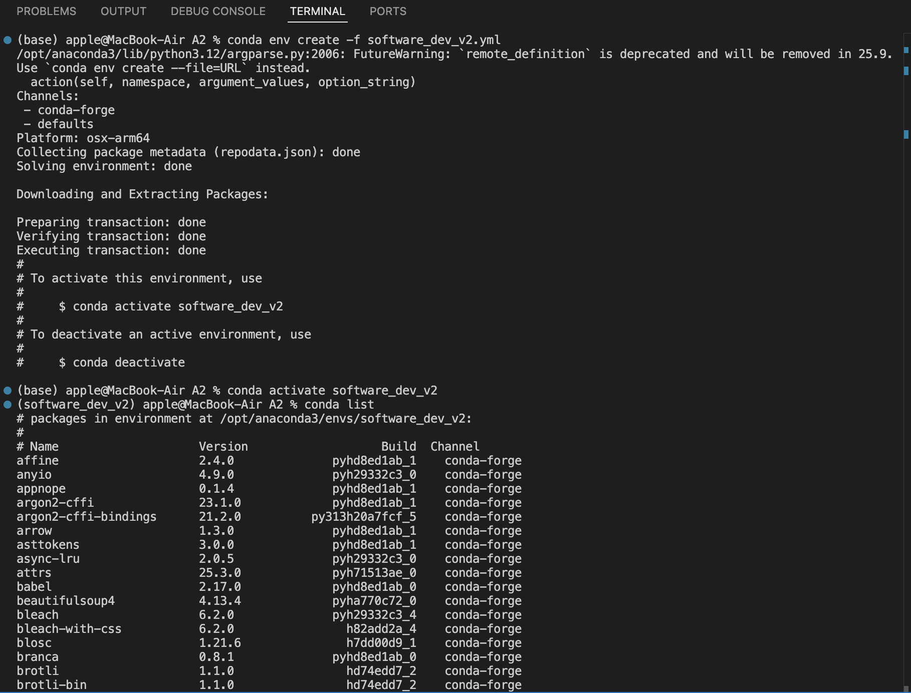

# geo-software-dev
These are the steps I followed for the assignment:
## Step 1 - Get the .yml files
I forked the assignment repository and cloned it to my machine

## Step 2 - Create the specified environments - V1
### 2.1 - The wrong way of doing it
I made the mistake of executing `conda create --name software_dev_v1.yml` instead of the correct way of doing it, and this command created an empty environment named `software_dev_v1.yml` because I later realised `--name` is used to specify the environment name, not the .yml file. There were no packages in this environment when I executed `conda list` 😅

### 2.2 - Still figuring it out...
Before proceeding I executed `conda deactivate` to deactivate the wrong environment I previously created and then removed it by running `conda remove --name software_dev_v1.yml --all`

However, when I ran `conda env create -f software_dev_v1.yml`, I got this error message:

**I wasn't in the right directory!** I changed that but I still ran into errors. I got 2 errors: the environment creation failed due to unavailable / incompatible packages specified in the software_dev_v1.yml file, for the OSX ARM64 platform I'm using. The error messages indicated that several required packages and versions were not found in the default channels.

### 2.3 - Resolving the errors
To resolve the errors I was running into, I modified the .yml file to remove specific version constraints and added the conda-forge channel to increase the likelihood of finding compatible packages.  I also removed Windows specific dependencies that were not compatible with my platform and it worked 😄

## Step 3 - Create the specified environments - V2
Everything executed successfully! 

